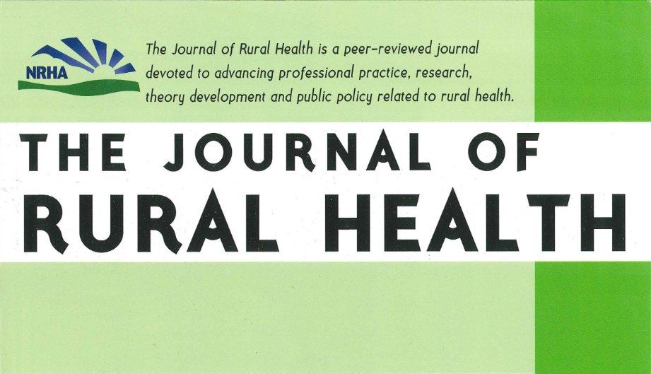

## Introduction

:::: {grid} 1 12 12 12
:class: intro-bio-grid

:::{grid-item}
:columns: 4

EducatorEconomistEntrepreneur

  

    

    

    

    

    

    

    

    

    

  

:::

:::{grid-item}
:columns: 8
I am an applied economist working at the intersection of health economics, institutional economics, and economics education. I study how regulation and market structure shape healthcare labor markets, licensing and scope of practice, and patient outcomes, using causal inference and policy evaluation.

I also examine substance use disorder policy, including treatment access, certificate-of-need laws, and opioid and prescription-monitoring systems.

In addition, I study generative AI and assessment design for learning at scale.

I am a research fellow at the [Archbridge Institute](https://www.archbridgeinstitute.org/). Through the National Institutes of Health I contribute to AIM-AHEAD Bridge2AI: I was a research fellow in the Clinical Care Training Program, and I am a mentor for the AI-READI and CLINAQ fellowship programs.

Beyond journal articles, I write policy briefs and evidence products for foundations, policy institutes, and state audiences. You can find my [CV](book/cv/index.md).
:::

::::

---

## Featured links

::::{grid} 2 2 4 4

:::{card}
:link: https://scholar.google.com/citations?user=mvYtqK8AAAAJ&hl=en

+++
Google Scholar: publications and citations
:::

:::{card}
:link: https://www.nature.com/articles/s41586-025-10078-y

+++
Nature: replicability in the social and behavioural sciences
:::

:::{card}
:link: https://www.dropbox.com/scl/fi/6vupzn4iwu2jzzl4gnhtc/The-Journal-of-Rural-Health-2025-Sugg-Mapping-maternity-care-deserts-Driving-distance-and-health-outcomes-in-North.pdf?rlkey=zia9y7p4vinyz5uc72q0lzuct&st=g5om58hn&dl=0

+++
NRHA Article of the Year 2025: Journal of Rural Health (maternity care deserts)
:::

:::{card}
:link: https://mymeritguide.com

+++
MyMeritGuide: founding engineer, FERPA-aware, AI-assisted oral exams and learning validation
:::

::::

---
