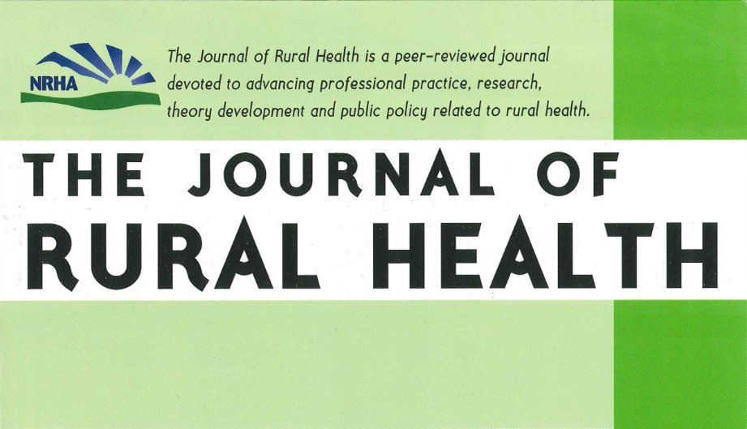

:::: {grid} 1 12 12 12
:class: intro-bio-grid

:::{grid-item}
:columns: 4

EducatorEconomistEntrepreneur

:::

:::{grid-item}
:columns: 8
I am an applied economist working at the intersection of health economics, institutional economics, and economics education. I study how regulation and market structure shape healthcare labor markets, licensing and scope of practice, substance use policy, and patient outcomes, using causal inference and policy evaluation. I also study generative AI and assessment design for learning at scale, and I am Founding Engineer of [MyMeritGuide](https://mymeritguide.com/).

I am a Research Affiliate at the [Knee Regulatory Research Center](https://knee.wvu.edu/contact-us/research-affiliates) (West Virginia University), a Nonresident Scholar at the [Challey Institute](https://www.ndsu.edu/challeyinstitute/), and a Research Fellow at the [Archbridge Institute](https://www.archbridgeinstitute.org/). Through NIH AIM-AHEAD Bridge2AI I mentor AI-READI and CLINAQ fellows.

**Contact**: [CV PDF](book/cv/cv.pdf) · [ORCID](https://orcid.org/0000-0002-6272-6654) · [Google Scholar](https://scholar.google.com/citations?user=mvYtqK8AAAAJ&hl=en) · [shakyas@appstate.edu](mailto:shakyas@appstate.edu)
:::

::::

---

## Featured links

::::{grid} 2 2 4 4

:::{card}
:link: https://scholar.google.com/citations?user=mvYtqK8AAAAJ&hl=en

+++
Google Scholar: publications and citations
:::

:::{card}
:link: https://www.nature.com/articles/s41586-025-10078-y

+++
Nature: replicability in the social and behavioural sciences
:::

:::{card}
:link: https://www.dropbox.com/scl/fi/6vupzn4iwu2jzzl4gnhtc/The-Journal-of-Rural-Health-2025-Sugg-Mapping-maternity-care-deserts-Driving-distance-and-health-outcomes-in-North.pdf?rlkey=zia9y7p4vinyz5uc72q0lzuct&st=g5om58hn&dl=0

+++
NRHA Article of the Year 2025: Journal of Rural Health (maternity care deserts)
:::

:::{card}
:link: book/projects/oral-exam-mymerits.md

+++
MyMeritGuide: founding engineer, FERPA-aware, AI-assisted oral exams and learning validation (free for teachers)
:::

:::{card}
:link: https://www.youtube.com/watch?v=bqY-9tUCJ7o

+++
Ignite Resilience: interview with Trish Oxford (YouTube)
:::

:::{card}
:link: https://youtu.be/qmMgv7sdLA4?t=109

+++
Challey Institute: Human Progress and Flourishing Workshop (YouTube)
:::

:::{card}
:link: https://www.youtube.com/watch?v=8XUKn-raeG8

+++
Decode Econ: AI in the classroom (YouTube)
:::

:::{card}
:link: https://www.youtube.com/watch?v=q2dXo21SNJQ

+++
MyMeritGuide: scalable online oral examination (YouTube)
:::

::::

---

## Research

- [All publications](book/cv/publications.md) (each entry links to its Paper note where one exists)
- Flagship Publication: [Investigating the replicability of the social and behavioural sciences](https://doi.org/10.1038/s41586-025-10078-y) (*Nature*, SCORE)
- Also: [Scope of practice and opioid prescribing behavior of nurse practitioners serving Medicare beneficiaries](https://doi.org/10.1002/hec.4904) (*Health Economics*)

## For teachers and students

- [MyMeritGuide](book/projects/oral-exam-mymerits.md): AI-assisted oral exams and learning validation (free for teachers)
  - [MyMeritGuide: scalable online oral examination](https://www.youtube.com/watch?v=q2dXo21SNJQ) (YouTube)
  - [How to register as a professor](https://youtu.be/yQaakZF8AOg)
  - [How to create a course](https://youtu.be/1D7iF68iBkc)
  - [How to create an oral assignment](https://youtu.be/ereo-7-_QGU)
- Grain of Salt (my view, not a research claim): [Stop Policing AI Use. Observe Learning.](book/grain-of-salt/2026-09-12-stop-policing-ai-use.md)

## For policy readers

- [Paper notes](book/paper-notes/index.md): short, policy-facing explainers of selected Publications
- Start here: [Maternity care deserts in North Carolina](book/paper-notes/2025-01-01-maternity-care-deserts-nc.md)
- [Op-eds and popular writing](book/cv/op-eds-and-popular-writing.md)
