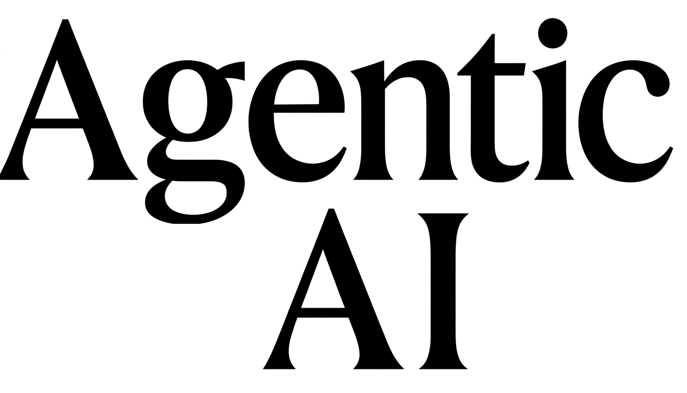
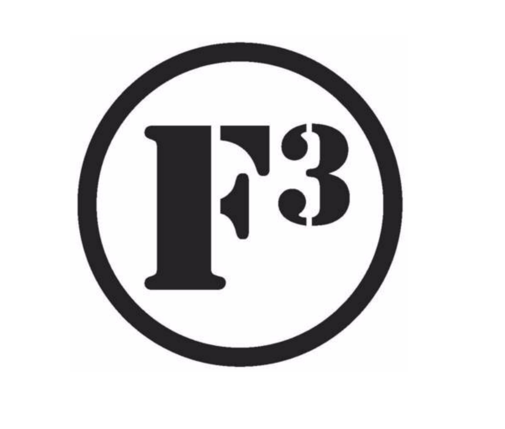

:::: {grid} 1 12 12 12
:class: intro-bio-grid

:::{grid-item}
:columns: 4

EducatorEconomistEntrepreneur

  

    

    

    

    

    

    

    

    

    

  

:::

:::{grid-item}
:columns: 8
I am an applied economist working at the intersection of health economics, institutional economics, and economics education. I study how regulation and market structure shape healthcare labor markets, licensing and scope of practice, and patient outcomes, using causal inference and policy evaluation.

I also examine substance use disorder policy, including treatment access, certificate-of-need laws, and opioid and prescription-monitoring systems. In parallel, I study generative AI and assessment design for learning at scale, and I am Founding Engineer of [MyMeritGuide](https://mymeritguide.com/), an agentic-AI platform for authentic oral assessment.

I am a Research Affiliate at the [Knee Regulatory Research Center](https://knee.wvu.edu/contact-us/research-affiliates) at West Virginia University, a Nonresident Scholar at the [Sheila and Robert Challey Institute for Global Innovation and Growth](https://www.ndsu.edu/challeyinstitute/), and a Research Fellow at the [Archbridge Institute](https://www.archbridgeinstitute.org/). Through the National Institutes of Health I contribute to AIM-AHEAD Bridge2AI: I was a research fellow in the Clinical Care Training Program, and I am a mentor for the AI-READI and CLINAQ fellowship programs.

Beyond journal articles, I write policy briefs and evidence products for foundations, policy institutes, and state audiences. You can find my [CV](book/cv/index.md). ORCID: [0000-0002-6272-6654](https://orcid.org/0000-0002-6272-6654).
:::

::::

---

## Featured links

::::{grid} 2 2 4 4

:::{card}
:link: https://scholar.google.com/citations?user=mvYtqK8AAAAJ&hl=en

+++
Google Scholar: publications and citations
:::

:::{card}
:link: https://www.youtube.com/watch?v=bqY-9tUCJ7o

+++
Ignite Resilience: interview with Trish Oxford (YouTube)
:::

:::{card}
:link: https://youtu.be/qmMgv7sdLA4?t=109

+++
Challey Institute: Human Progress and Flourishing Workshop (YouTube)
:::

:::{card}
:link: https://www.youtube.com/watch?v=8XUKn-raeG8

+++
Decode Econ: AI in the classroom (YouTube)
:::

::::

---

## Research

- [All publications](book/cv/publications.md) (each entry links to its Paper note where one exists)
- Flagship Publication: [Investigating the replicability of the social and behavioural sciences](https://doi.org/10.1038/s41586-025-10078-y) (*Nature*, SCORE)

## For students

- Books: [Mostly Handsdirty Metrics](https://mhdm.netlify.app/) · [Applied Business Statistics with NOAA Data & Agentic-AI](https://econ2200.netlify.app/)
- [MyMeritGuide](book/projects/oral-exam-mymerits.md): AI-assisted oral exams and learning validation
- Grain of Salt (my view, not a research claim): [Stop Policing AI Use. Observe Learning.](book/grain-of-salt/2026-09-12-stop-policing-ai-use.md)

## For policy readers

- [Paper notes](book/paper-notes/index.md): short, policy-facing explainers of selected Publications
- Start here: [Maternity care deserts in North Carolina](book/paper-notes/2025-01-01-maternity-care-deserts-nc.md)
- Media and policy contact: [shakyas@appstate.edu](mailto:shakyas@appstate.edu)
